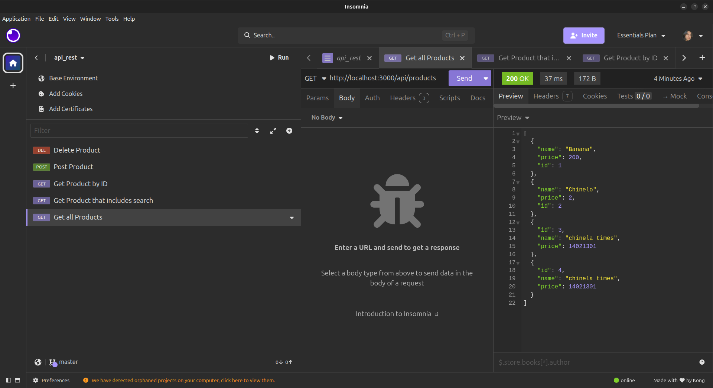
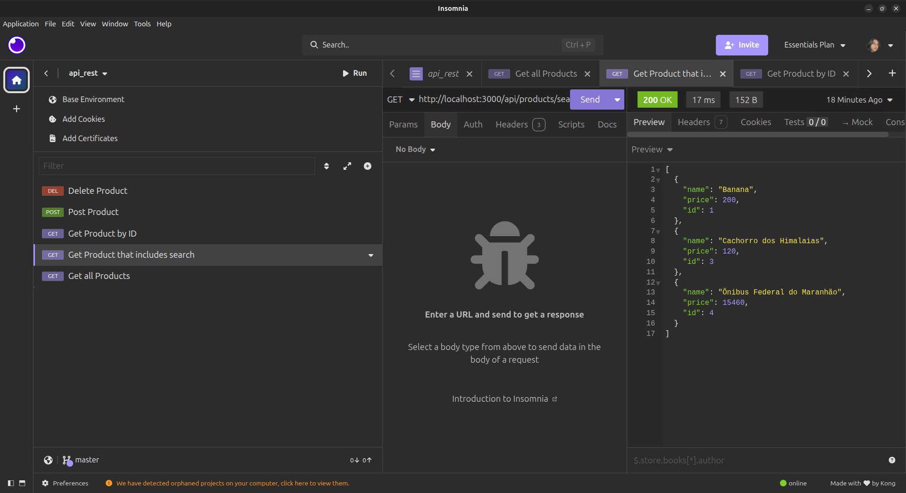
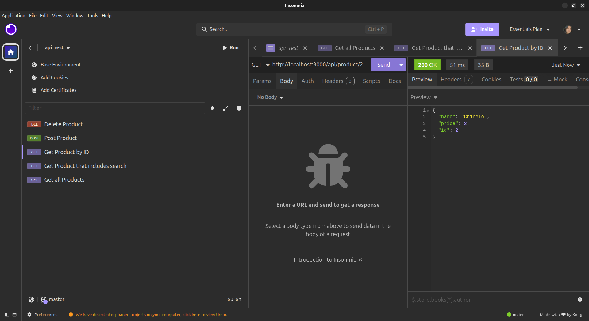
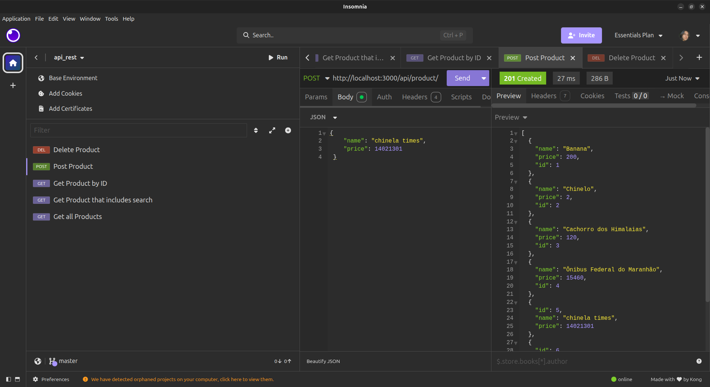
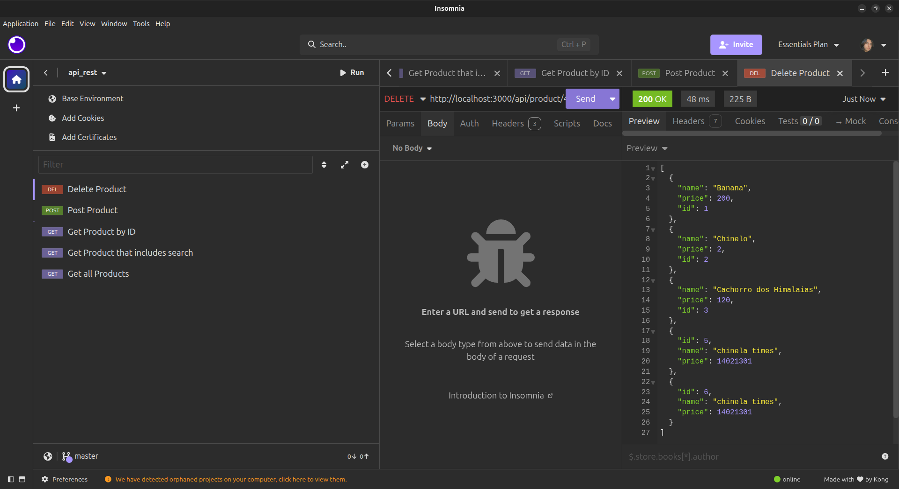

# Product API (Express + EJS)

A simple Product CRUD API built with Node.js, Express, and Server-Side Rendering (SSR) via EJS. Data is managed in-memory.

## 🚀 Technologies

- **Node.js**
- **Express**
- **EJS** (Embedded JavaScript templating)
- **Method-Override** (For PUT, PATCH, and DELETE requests from HTML forms)
- **Dotenv** (Environment variable management)

---

## 🛠️ How to Run

1. Clone the repository.
2. Install dependencies:

```bash
npm install
```

3. Create a .env file in the root directory and define the port:

```

PORT=3000

```

4. Run the application:

```

node server.js

```

5. Access the app in your browser at: http://localhost:3000

## 📦 Data Structure

Products are stored as objects in an array with the following structure:

```

{
"id": 123456,
"name": "Product Name",
"price": 10.50
}

```

GET /api/products List all products


GET /api/products/search?q=term Search products by term


GET /api/product/:id Get a specific product by ID


POST /api/product Create a new product { "name": "Mouse", "price": 50 }


DELETE /api/product/:id Delete a product


## Validations

1. Name: Must not be empty.

2. Price: Must be a valid number greater than 0.

3. ID: Must exist in the database for PUT, PATCH, and DELETE operations.

# Notes

1. ID Generation: Unique IDs are automatically generated using Date.now().

2. Storage: Data is stored in memory. Any changes will be lost when the server restarts.

3. Views: Uses Server-Side Rendering (SSR) to serve EJS templates.
